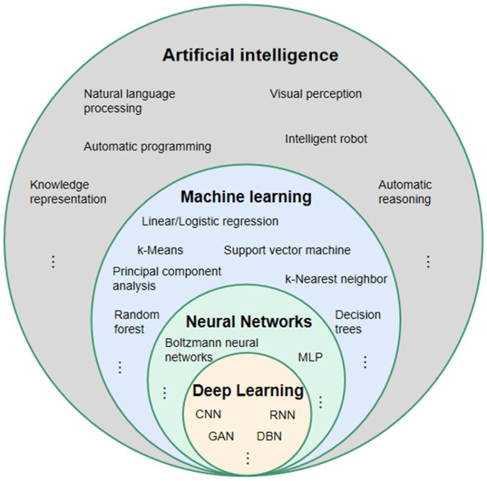

## Was ist Künstliche Intelligenz eigentlich

---

---

# Artificial intelligence

---

# Schwache KI

(Narrow Ai)
- spezifische Aufgaben
- viele Künstliche Intelligenzen zählen zur schwachen (z.b Siri)

---

# Starke KI

(general Ai)

==**soll in der Lage sein, menschliche Intelligenz zu imitieren**==

- unterschiedlichste Aufgaben lösen
- kreativ sein 
- selbstständig lernen

*Bisher gibt es jedoch noch keine echte starke KI nur Ansätze*

---

# Neural Networks
Diese Programmierte Struktur ist aus was KI entstehet

---

# Machine Learning

---

# Deep Learning

## Reinforcment Learning

---

# Agent vs Model

---

# Pseudo Code
while loop: grid == alt grid
	move(counter)
	counter++
			
when counter == 4 
	done == true

---

### Quellen
- [www.ibm.com/artifical-intellegance](https://www.ibm.com/topics/artificial-intelligence)
- [www.visusadvisory.com](https://www.visusadvisory.com/post/starke-vs-schwache-ki#:~:text=Schwache%20KI%20kann%20beispielsweise%20Daten,general%20oder%20strong%20AI%20genannt)
- [developers.google.com/machine-learning/gloassary](https://developers.google.com/machine-learning/glossary?hl=de#e)